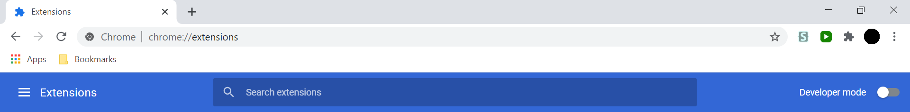

# jsInserter 

### Edit and run JavaScript while browsing a website

## What is this

jsInserter is an open source chrome extension for editing and running JavaScript while browsing any website

## Why not just use the console

There are actually some [custom functions](#docs) in the extension

## How do I install it

Make sure you have downloaded the extension folder first, and then:

1. Go to chrome://extensions

   

2. Enable developer mode

   

3. Click "Load unpacked"

   

4. Select the jsInserter folder

   

## How do I use it

Go to any website, click the extensions icon , click jsInserter , and start coding.

## How do I run my code

You literally just press run.

###### Note: it only works in `http://` and `https://` pages that enable `eval()`. If it doesn't work, the website probably disabled `eval()`. But it does work on big websites like [`https://youtube.com/`](https://youtube.com/).

## Docs

`$(sel: string): HTMLElement`

Returns the first element matching the selector

```js
const button = $("button.run");
console.log(button); // <button class="run"><b>Run</b></button>
```

`insertHTML(html: string, parent: HTMLElement)`

Insert HTML into an element

```js
insertHTML("&nbsp;<b>your script</b>", $("button.run")); // <jsinserter-element>&nbsp;<b>your script</b></jsinserter-element>
```
